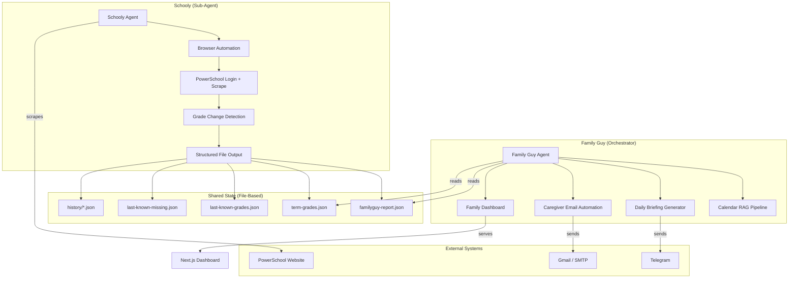
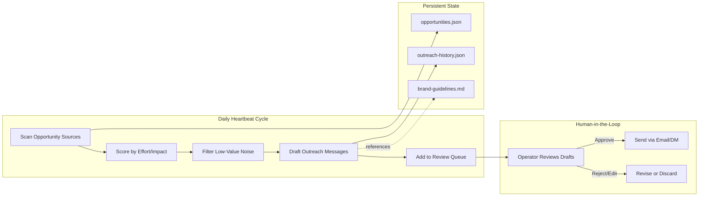
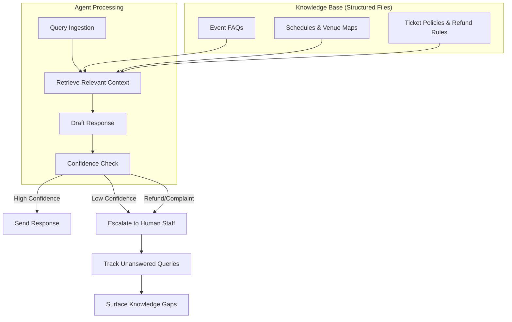
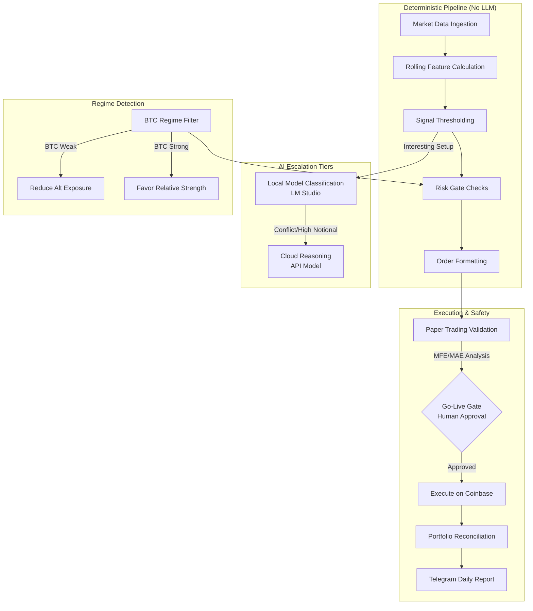
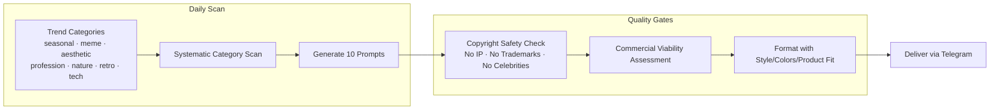

# Agentic Systems Architecture

Architecture documentation, workflow diagrams, and design decisions for the multi-agent systems I've built on [OpenClaw](https://openclaw.com). These are production systems that run daily on scheduled cron jobs, scrape live data, make structured decisions, and deliver results through dashboards and automated notifications.

**No source code is included** — this repo documents the *thinking* behind the systems: how agents are decomposed, how context is managed, where humans stay in the loop, and why specific design tradeoffs were made.

> **[View live dashboard screenshots and full project details on my portfolio site](https://tinyurl.com/jasoncarpenter-portfolio)**

---

## Systems Overview

| System | What It Does | Model | Schedule |
|--------|-------------|-------|----------|
| [Family Guy](#family-guy--schooly) | Family operations orchestrator — calendar RAG, daily briefings, caregiver email automation | Kimi K2.5 | Daily 6:30 AM |
| [Schooly](#family-guy--schooly) | PowerSchool grade scraper and missing assignment tracker (sub-agent to Family Guy) | Kimi K2.5 | Weekdays 7:30 AM |
| [Lyra (Marketing)](#lyra-marketing-outreach-agent) | Autonomous marketing opportunity scanner with human-in-the-loop outreach | Cloud LLM | Daily |
| [CS Agent](#customer-service-agent) | Attendee support with structured FAQ retrieval and escalation rules | Cloud LLM | On-demand |
| [Trader](#crypto-trading-agent) | Deterministic-first crypto trading with multi-tier AI escalation | Local + Cloud | Every 15 min |
| [Trendy](#trendy-print-on-demand-trend-agent) | Daily trend research generating production-ready image prompts | Qwen3 8B (local) | Daily |

---

## Family Guy + Schooly

A two-agent system for family operations. Family Guy is the orchestrator; Schooly is a focused sub-agent that handles data collection.

### Architecture

### Design Decisions

**Why two agents instead of one?**
Schooly's job is narrow and well-defined: log into PowerSchool, scrape grades, compare against last-known state, write files. Family Guy's job is broad: calendar management, daily briefings, email automation. Combining them would create a bloated context window and make failures harder to diagnose. By decomposing, each agent has a focused heartbeat contract with clear success criteria.

**Why file-based inter-agent communication?**
Schooly writes JSON files to a shared status directory. Family Guy reads them during its own heartbeat. This is deliberately simple — no message queues, no RPC, no shared database. Files are inspectable, diffable, and debuggable. When Schooly's output format was wrong, I could `cat` the JSON and see the problem immediately.

**Why RAG for the calendar?**
School calendars change frequently and contain hundreds of events. Stuffing the full calendar into every prompt would waste tokens and dilute attention. Instead, Family Guy ingests calendar PDFs into structured JSON, then retrieves only the relevant date range per query. This keeps prompts focused and costs down.

**Grandma email automation:**
Family Guy checks the custody calendar and school schedule each morning. On days when Grandma has pickup duty, it sends her a personalized email with the correct pickup time — automatically adjusting for half-days and early dismissals. This is a deterministic action triggered by calendar data, not an LLM decision.

### Failure Case Study: The Silent Login Bug

Schooly's login to PowerSchool failed silently — the browser automation accepted the fill command and submitted the form, but the username and password fields were empty. The root cause: the LLM model (Kimi K2.5) was emitting `{ref, text}` for fill fields, but the browser tool expected `{ref, value}`. The `text` field was silently ignored, and `value` defaulted to an empty string.

**How it was diagnosed:** Reading the session JSONL logs line by line, tracing from the model's output → browser tool action → form field normalization function → the actual HTTP request. The fix was a two-line change adding `text` as a fallback alias for `value` — patched in both source and compiled dist.

**Lesson:** When an LLM-driven system fails, the failure mode is often *silent correctness* — the system does exactly what it's told, but what it's told is subtly wrong. You need inspectable logs at every layer.

---

## Lyra (Marketing Outreach Agent)

An autonomous marketing agent that scans for free and low-cost growth opportunities, drafts outreach messages, and surfaces prioritized action items — with human approval required before any external communication is sent.

### Workflow

### Key Design Pattern: Graduated Autonomy

Lyra can autonomously scan, score, and draft — but **cannot send** without human approval. This is deliberate: the cost of a bad marketing email is brand damage, which is hard to undo. The approval gate is the cheapest insurance against that risk.

The agent's workspace files (opportunities, outreach history, brand guidelines) serve as persistent memory across heartbeats. The model doesn't need to remember previous runs — it reads the current state from files each cycle.

---

## Customer Service Agent

Handles attendee inquiries for live events with structured FAQ retrieval and explicit escalation rules.

### Context Architecture

### Design Decision: Why Not Just Use a Chatbot?

A generic chatbot would hallucinate event details. Instead, the CS agent retrieves from structured source-of-truth files for every response. If the answer isn't in the knowledge base, it escalates rather than guessing. Unanswered queries are tracked to surface gaps — the system gets smarter over time by showing the operator what's missing.

---

## Crypto Trading Agent

A deterministic-first trading system where the LLM is the *last* thing in the pipeline, not the first.

### Architecture

### Key Design Pattern: Deterministic-First

The most important design decision: **the LLM doesn't make trading decisions**. Market ingestion, feature calculation, thresholding, risk caps, and order formatting all run as deterministic code. The model only enters the pipeline after code-based filters have already flagged a potentially interesting setup.

**Why?** Because LLMs are confident even when they're wrong, and in trading, a confidently wrong decision costs real money. Deterministic gates ensure that no trade executes without passing hard-coded risk checks first. The LLM adds nuance; the code provides guardrails.

**Multi-tier escalation:** Local LM Studio handles cheap classification (is this setup worth considering?). Cloud reasoning is reserved for conflict resolution or higher-notional decisions. This keeps inference costs proportional to decision stakes.

---

## Trendy (Print-on-Demand Trend Agent)

Daily trend research generating production-ready image generation prompts for print-on-demand merchandise.

### Workflow

### Design Decision: Why a Local Model?

Trendy runs on Qwen3 8B via LM Studio — zero API cost per run. The task is well-scoped enough (scan categories, generate structured prompts, check copyright safety) that a small local model handles it effectively. There's no reason to pay for cloud inference when the task fits within local model capabilities.

### Copyright Safety as a Specification Problem

Early iterations showed the model gravitating toward fan-art concepts (Marvel characters, Disney themes) that would get flagged on Redbubble and TeePublic. The fix wasn't a content filter — it was a specification change: the heartbeat contract now explicitly enumerates what to avoid, and each prompt includes a copyright-safety rationale field that forces the model to justify why the design is safe to sell.

---

## Cross-Cutting Design Principles

These patterns appear across all the systems:

1. **Heartbeat contracts** — Every agent has a step-by-step checklist defining exactly what it does each cycle. Ambiguity in the spec causes the LLM to skip steps or reorder operations.

2. **File-based state** — Agents read and write structured JSON files. No conversation memory for critical state. Files are inspectable, diffable, and survive restarts.

3. **Graduated autonomy** — Agents can do more internally (scan, score, draft) but require human approval for external actions (send emails, execute trades, post publicly). The approval threshold scales with the cost of error.

4. **Deterministic where possible** — Code handles data ingestion, formatting, risk checks, and normalization. The LLM handles reasoning, classification, and natural language generation. Don't use an LLM for something a function can do.

5. **Inspectable failure modes** — Session logs, structured file output, and dashboard monitoring at every layer. When something breaks, you need to trace through the exact sequence of model outputs and tool calls.

6. **Cost-proportional model selection** — Local models for cheap daily tasks, cloud models for high-stakes decisions. Free-tier models where the task fits. The system's daily operating cost is under $0.10.

---

## About

Built by [Jason Carpenter](https://tinyurl.com/jasoncarpenter-portfolio) — Applied AI Engineer, Metro Detroit, MI.

These systems are in daily production use. Architecture docs are shared publicly to demonstrate design thinking; source code remains private.
